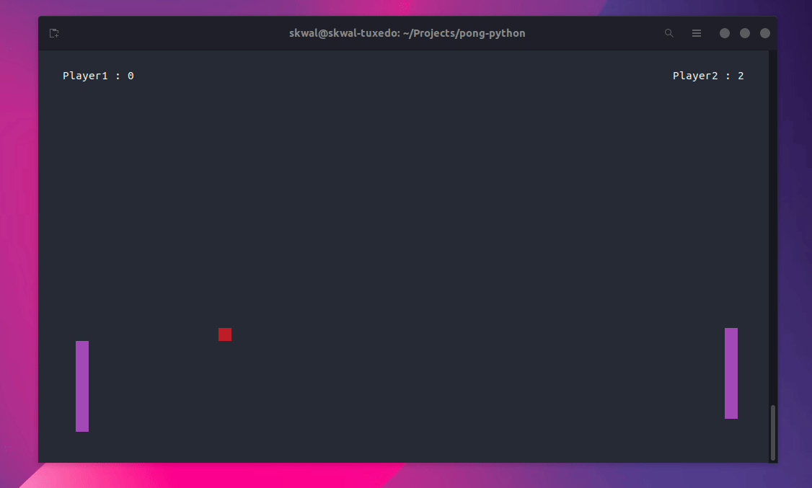

# Pong Python 🏓

This is a simple pong game made with Python that you can play in your terminal.



# Installation

First, clone this repository and `cd` into it:

```bash
git clone https://github.com/SkwalExe/pong-python.git
cd pong-python
```

Then, install the dependencies:

```bash
pip install -r requirements.txt
```

Finally, launch the game with python
    
```bash
python src/main.py
```

# Usage


# Controls

- Use the arrow keys to move the paddle
- Use `ESC` to quit the game
- Use `SPACE` to pause the game

# final

If you have any problem, dont hesitate to open an issue.

# contributing

Pull requests are welcome. For major changes, please open an issue first to discuss what you would like to change.    